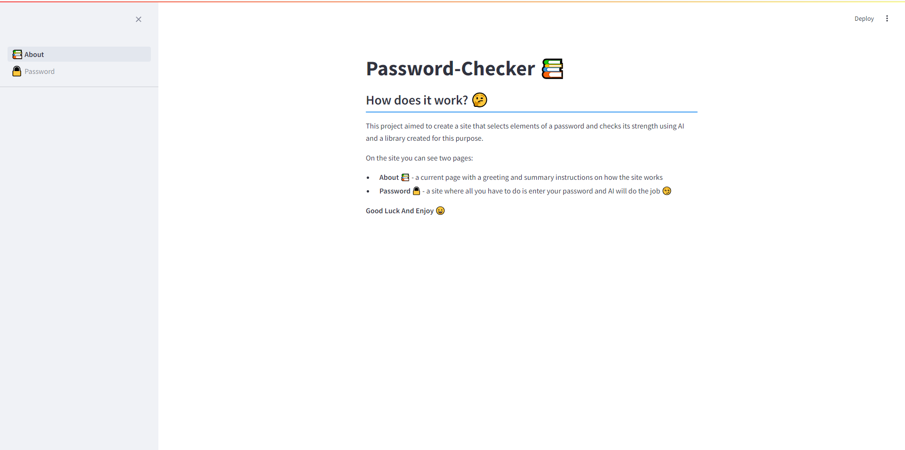

# Password-Checker-AI

The goal of this project was to create a site that selects elements of a password and checks its strength using AI and a library created for this purpose.<br>
The related work along with the AI model can be found on my <b><a href="https://www.kaggle.com/mateo252">KaggleProfile.</a></b>

# How it works

The application includes two pages:
- **About** 📚 - page with a greeting and summary instructions on how the site works
- **Password** 🔒 - a site where all you have to do is enter your password and AI will do the job 😏




<br>

# Installation
**No** additional program or api key is needed. <br>
The finished model **is included** in the files. <br>
Just download this repository. 😀<br>
And **REMEMBER** to run the code from the **src** folder along with the model.

Download a repository
```
> git clone https://github.com/mateo252/Password-Checker-AI.git

> cd Password-Checker-AI
```

Create a virtual environment and install requirements (require Python <= 3.12)

```
> python -m venv venv

> venv\Scripts\activate

(venv) > pip install -r requirements.txt
```

Finally run a project
```
(venv) > cd src

(venv) > streamlit run 📚About.py
```

# License
MIT